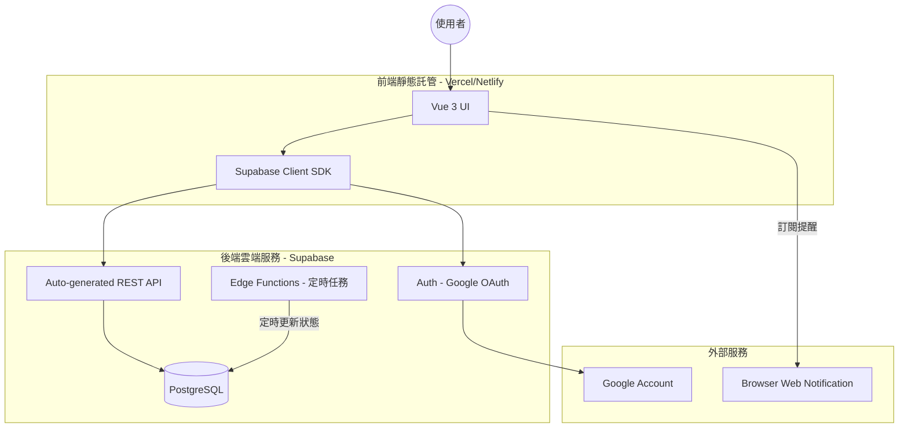

# Linetra — 系統架構設計文件 (Serverless / Supabase)

> [!NOTE]
> 本文件詳述 Linetra 平台的 Serverless 架構。為了達成個人使用的「零成本維護」目標，我們採用 Supabase 作為後端服務，並將前端部署於免費的靜態託管平台。

| 屬性 (Metadata) | 內容 (Content) |
| :--- | :--- |
| **文件版本 (Version)** | `v1.1 (Serverless)` |
| **最後更新 (Last Updated)** | 2026-05-29 |

---

## 1. 高階架構圖 (Zero-Cost Architecture)

利用 BaaS (Backend as a Service) 方案省去傳統伺服器開銷。



---

## 2. 核心技術棧 (Tech Stack)

### 2.1 前端 (Frontend) - $0
*   **Vue 3 (Vite + TS)**: 核心框架。
*   **Supabase JS SDK**: 直接在前端與資料庫通訊，取代傳統的 API 請求。
*   **Vercel / Cloudflare Pages**: 靜態網站託管，支援自動部署。

### 2.2 後端與儲存 (BaaS) - $0
*   **Supabase Auth**: 處理 Google 登入，並透過 RLS (Row Level Security) 確保使用者只能存取自己的案件。
*   **Supabase Database (PostgreSQL)**: 核心資料庫，支援複雜的 SQL 查詢。
*   **Supabase Edge Functions**: 輕量級的 Deno 函數，用於處理 Cron Job（如：每 10 分鐘檢查逾期案件並觸發提醒）。

---

## 3. 關鍵機制：如何省去後端程式碼？

### 3.1 零代碼 API (PostgREST)
Supabase 會根據資料表結構自動產生 API。例如，前端只需要呼叫：
```typescript
const { data } = await supabase.from('reports').select('*').eq('status', 'pending');
```
這就完成了原本需要在 FastAPI 中寫 Controller、Service 和 Repository 的所有工作。

### 3.2 資料安全性 (RLS)
透過 PostgreSQL 的 **Row Level Security (RLS)**，我們在資料庫層級下指令：
`CREATE POLICY "Users can only see their own reports" ON reports FOR ALL TO authenticated USING (auth.uid() = user_id);`
這確保了即使沒有後端伺服器做過濾，資料也絕不會外洩給其他使用者。

---

## 4. 成本估算 (Cost Analysis)

| 項目 | 服務 | 費用 | 備註 |
| :--- | :--- | :--- | :--- |
| **網頁託管** | Vercel | $0 | 個人專案無限期免費 |
| **身份驗證** | Supabase Auth | $0 | 50,000 MAU 額度 |
| **資料庫** | Supabase DB | $0 | 500MB 儲存空間 |
| **定時任務** | Supabase Functions | $0 | 每月 200 萬次調用額度 |
| **總計** | | **$0 / 月** | **完美達成零預算開發** |
