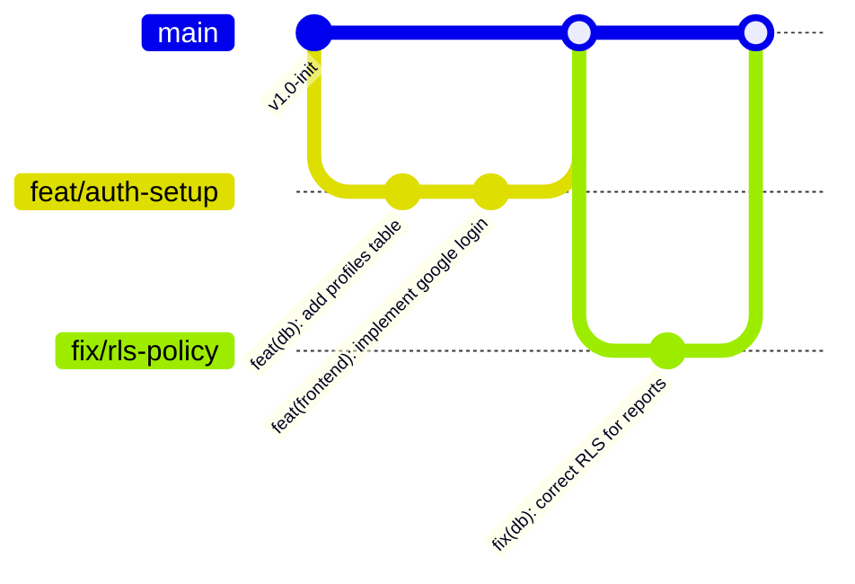

# Linetra — 專案架構與開發規範指南 (Project Architecture & Development Guidelines)

> [!NOTE]
> 本指南旨在為 Linetra 專案提供清晰的目錄架構、Serverless 開發策略、文件管理機制以及 Git 版本控制規範。

| 屬性 (Metadata) | 內容 (Content) |
| :--- | :--- |
| **文件版本 (Version)** | `v1.1` |
| **文件狀態 (Status)** | 已啟用 (Active) |
| **發布日期 (Created Date)** | 2026-05-24 |
| **最後更新 (Last Updated)** | 2026-06-06 |
| **主要作者 (Author)** | Linetra Dev Team |

---

## 1. 開發架構策略：Serverless 與 Monorepo 的結合

根據最新系統架構設計，Linetra 採用 Serverless (BaaS) 架構，以達成零成本維護目標。

### 方案：單一儲存庫 (Monorepo)
將前端與 Supabase 設定（包含 Edge Functions 與 Migration）放在同一個 Git 儲存庫中，但在邏輯目錄上徹底解耦。

*   **優點**：
    *   **單一事實來源 (Single Source of Truth)**：前端開發與資料庫變更、Edge Functions 邏輯可在同一個提交中完成。
    *   **共享配置與文件**：產品需求文件 (PRD)、系統架構文件 (Architecture Docs) 集中管理。
    *   **極低維護開銷**：省去管理多個儲存庫的權限與分支。

### Linetra 專案的最終建議
鑑於採用 Supabase 作為後端服務，專案不再需要傳統的伺服器後端 (如 Python/FastAPI)。建議採用「單一儲存庫」結構，將前端程式碼與 Supabase 設定分別存放於 `frontend/` 與 `supabase/` 資料夾。

---

## 2. 建議的專案目錄架構 (Recommended Directory Structure)

基於 Serverless Monorepo 的設計原則，以下是 Linetra 的專案目錄架構：

```text
D:\Repos\Linetra\
├── .github/                   # GitHub 平台專用設定 (CI/CD)
│   └── workflows/             # GitHub Actions 自動化管線
│       ├── frontend-deploy.yml # 前端部署管線 (Vercel/Cloudflare)
│       └── supabase-deploy.yml # Supabase Edge Functions 部署管線
│
├── supabase/                  # Supabase 配置與後端邏輯
│   ├── functions/             # Edge Functions (Deno / TypeScript)
│   │   └── reminder-cron/     # 定時提醒任務
│   ├── migrations/            # 資料庫遷移腳本 (SQL)
│   ├── seed.sql               # 測試資料種子
│   └── config.toml            # Supabase CLI 設定檔
│
├── frontend/                  # 前端專案目錄 (Vue 3 / TypeScript / Vite)
│   ├── src/
│   │   ├── assets/            # 靜態資源
│   │   ├── components/        # UI 元件
│   │   ├── composables/       # 組合式邏輯 (含 Supabase SDK 調用)
│   │   ├── router/            # 頁面路由
│   │   ├── stores/            # 狀態管理 (Pinia)
│   │   ├── views/             # 頁面元件
│   │   ├── App.vue            # 根元件
│   │   └── main.ts            # 入口點
│   ├── tests/                 # 前端測試
│   ├── index.html
│   ├── package.json
│   └── vite.config.ts
│
├── docs/                      # 專案文件庫
│   ├── product/               # 產品與業務文件
│   │   ├── prd.md
│   │   └── user_stories.md
│   ├── architecture/          # 系統與技術架構文件
│   │   ├── system_architecture.md
│   │   ├── database_design.md
│   │   └── state_machine.md
│   ├── api/                   # 雖然使用 PostgREST，仍可用於存放自定義函數規格
│   │   └── openapi.yaml
│   └── guides/                # 開發者與運維指南
│       ├── local_setup.md
│       └── project_architecture_guidelines.md
│
├── tools/                     # 自動化工具與 Git Hooks
├── .gitignore
└── README.md
```

---

## 3. 文件管理機制

遵循「程式即文檔 (Docs as Code)」精神，將所有非機密文檔存放在 Git 中。

### 文件分類指南
1.  **`/docs/product/`**：PRD、功能清單、更新日誌。
2.  **`/docs/architecture/`**：系統架構、資料庫 RLS 設計、狀態機。推薦使用 Mermaid.js 繪製圖表。
3.  **`/docs/api/`**：雖然 Supabase 自動生成 API，但此處可用於記錄 Edge Functions 的介面。
4.  **`/docs/guides/`**：環境建置指南、開發規範。

---

## 4. Git 版本控制與分支策略

### 分支管理策略：GitHub Flow



*   **`main` 分支**：穩定分支，代表生產環境狀態。
*   **功能分支 (`feat/`)**：開發新功能。
*   **修復分支 (`fix/`)**：修復錯誤。

### Commit 訊息規範：約定式提交
格式：`<type>(<scope>): <subject>`

#### 類型 (Type) 說明
*   `feat`: 新功能。
*   `fix`: 修正錯誤。
*   `docs`: 修改文件。
*   `style`: 格式調整。
*   `refactor`: 重構。
*   `perf`: 效能優化。
*   `test`: 測試相關。
*   `chore`: 工具或依賴變更。

#### 影響範圍 (Scope) 建議
*   `frontend`: 前端異動。
*   `edge`: Supabase Edge Functions 異動。
*   `db`: 資料庫 Schema, RLS, Migration 異動。
*   `docs`: 文件修改。
*   `tools`: 腳本或工具異動。

#### 範例
*   `feat(db): 實作案件狀態機 RLS 策略`
*   `fix(edge): 修正逾期提醒郵件觸發邏輯`
*   `docs(guides): 更新架構規範以符合 Serverless 設計`

---

## 5. 後續執行步驟建議

1.  **建立骨架目錄**：依照上述結構建立 `frontend/` 與 `supabase/` 資料夾。
2.  **初始化 Supabase CLI**：在根目錄執行 `supabase init`。
3.  **前端專案初始化**：在 `frontend/` 中使用 Vite 初始化 Vue 3 專案，並安裝 `@supabase/supabase-js`。
4.  **配置開發環境**：參考 `docs/guides/local_setup.md` 設定 Supabase Local Development 環境。
5.  **導入 Git Hooks**：確保 `tools/git-hooks/` 中的腳本已啟用，以維持代碼品質。
