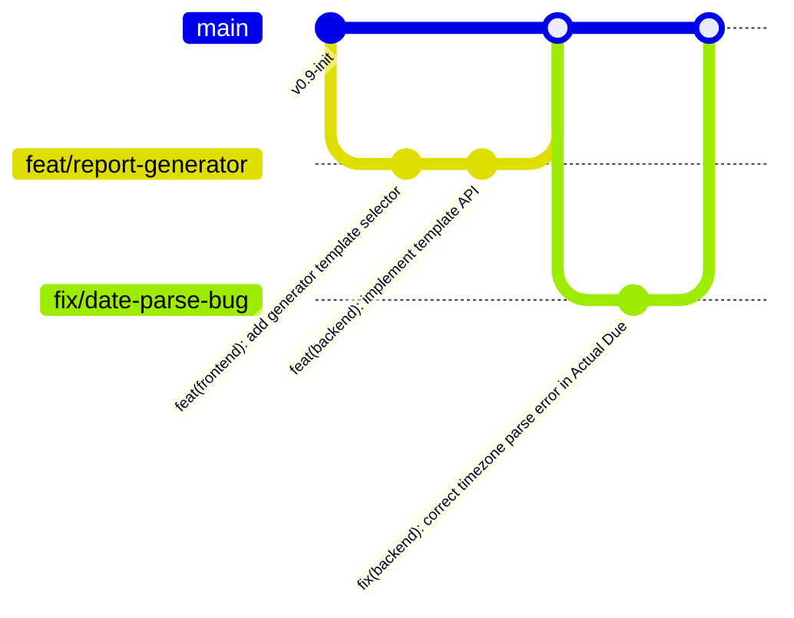

# Linetra — 專案架構與開發規範指南 (Project Architecture & Development Guidelines)

> [!NOTE]
> 本指南旨在為 Linetra 專案提供清晰的目錄架構、前後端分離策略、文件管理機制以及 Git 版本控制規範。

| 屬性 (Metadata) | 內容 (Content) |
| :--- | :--- |
| **文件版本 (Version)** | `v1.0` |
| **文件狀態 (Status)** | 已啟用 (Active) |
| **發布日期 (Created Date)** | 2026-05-24 |
| **最後更新 (Last Updated)** | 2026-05-24 |
| **主要作者 (Author)** | Linetra Dev Team |

---


## 1. 前後端專案區分策略：單一儲存庫 (Monorepo) 與 多儲存庫 (Polyrepo) 的抉擇

針對 Linetra 專案目前處於 **v1.0 (MVP 階段)**，我們對於是否在 Git 倉庫層面區分前後端專案進行了全面評估：

### 方案 A：單一儲存庫 (Monorepo / Mono-repository) —  強烈推薦
將前端與後端程式碼放在同一個 Git 儲存庫中，但在邏輯目錄上徹底解耦。

*   **優點**：
    *   **單一事實來源 (Single Source of Truth)**：所有功能開發（包含前後端聯調）可在同一個分支與同一個提交 (Commit) 中完成，避免跨儲存庫的程式碼不同步。
    *   **共享配置與文件**：產品需求文件 (PRD)、系統架構文件 (Architecture Docs)、以及環境部署腳本可集中管理，減少多專案切換的認知負荷 (Cognitive Load)。
    *   **極低維護開銷 (Low Maintenance Overhead)**：不需管理多個儲存庫的權限、分支與發布版本。
*   **缺點**：
    *   隨著專案擴大，儲存庫體積會變大，且持續整合與部署 (CI/CD) 管線需要設定條件式觸發 (Conditional Triggers) 以避免無謂的建置。

### 方案 B：多儲存庫 (Polyrepo / Multi-repositories)
將前端（Vue 3）與後端（Python）拆分為兩個完全獨立的 Git 儲存庫。

*   **優點**：
    *   **完全解耦 (Fully Decoupled)**：前端與後端擁有獨立的版本生命週期，各自的 CI/CD 流程更為單純。
    *   **職責分離 (Separation of Concerns)**：前端開發者與後端開發者各自專注於自己的儲存庫，減少無關代碼的干擾。
*   **缺點**：
    *   **跨端協同開銷高**：修改一個 API 規格通常需要同步提交兩個儲存庫的拉取請求 (Pull Request, PR)，增加審查與測試的複雜度。
    *   文件與部署設定容易變得支離破碎。

###  Linetra 專案的最終建議
鑑於本專案為 **行政通報與追蹤平台**，初期由少數開發者（或個人）主導，且強調快速迭代（包含雙重期限管理、狀態機等業務邏輯的聯調），**強烈建議採用「單一儲存庫 (Monorepo)」結構，但保持「資料夾物理隔離」**。 
未來若專案規模擴大、團隊成員倍增，可輕易將 `frontend` 與 `backend` 資料夾分離為獨立的 Polyrepo。

---

## 2. 建議的專案目錄架構 (Recommended Directory Structure)

基於 **Monorepo** 的設計原則，以下是為 Linetra 量身打造的專案目錄架構：

```text
D:\MVS\Linetra\
├── .github/                   # GitHub 平台專用設定 (CI/CD, Issue Templates)
│   └── workflows/             # GitHub Actions 自動化管線 (CI/CD Pipelines)
│       ├── frontend-ci.yml    # 前端測試與建置管線
│       └── backend-ci.yml     # 後端測試與部署管線
│
├── backend/                   # 後端專案目錄 (Python / FastAPI or Flask)
│   ├── app/                   # 後端核心邏輯
│   │   ├── api/               # API 路由與控制器 (Controllers / Routes)
│   │   ├── core/              # 核心配置、安全機制、常量定義 (Config & Core)
│   │   ├── models/            # 資料庫模型映射 (ORM Models / DB Schemas)
│   │   ├── services/          # 業務邏輯層 (Business Logic Services)
│   │   └── tasks/             # 排程任務與背景工作 (Scheduler & Background Tasks)
│   ├── tests/                 # 後端單元測試與整合測試 (Unit & Integration Tests)
│   ├── .env.example           # 後端環境變數範本
│   ├── requirements.txt       # Python 套件依賴清單
│   └── main.py                # 後端程式入口點 (Entry Point)
│
├── frontend/                  # 前端專案目錄 (Vue 3 / TypeScript / Vite)
│   ├── src/
│   │   ├── assets/            # 靜態資源 (Images, Icons, Global CSS)
│   │   ├── components/        # 可複用 UI 元件 (Reusable Components)
│   │   ├── composables/       # 組合式邏輯 (Vue 3 Composables / Hooks)
│   │   ├── router/            # 頁面路由設定 (Vue Router)
│   │   ├── services/          # API 請求封裝 (Axios / Fetch Wrappers)
│   │   ├── stores/            # 全域狀態管理 (Pinia Stores)
│   │   ├── views/             # 頁面級元件 (Pages / Views)
│   │   ├── App.vue            # 前端根元件
│   │   └── main.ts            # 前端入口點
│   ├── tests/                 # 前端單元測試與 E2E 測試
│   ├── index.html
│   ├── package.json           # 前端套件依賴清單
│   ├── tsconfig.json          # TypeScript 設定檔
│   └── vite.config.ts         # Vite 建置工具設定檔
│
├── docs/                      # 專案文件庫 (Centralized Documentation Hub)
│   ├── product/               # 產品與業務文件
│   │   ├── prd.md
│   │   └── user_stories.md    # 使用者故事與功能驗收標準
│   │
│   ├── architecture/          # 系統與技術架構文件
│   │   ├── system_architecture.md  # 系統架構圖與部署拓撲
│   │   ├── database_design.md      # PostgreSQL 資料庫綱要與關聯圖 (ERD)
│   │   └── state_machine.md        # 案件生命週期狀態機說明
│   │
│   ├── api/                   # API 介面規格書
│   │   └── openapi.yaml       # OpenAPI / Swagger 規格書
│   │
│   └── guides/                # 開發者與運維指南
│       ├── local_setup.md     # 本地開發環境建置指南
│       └── git_standard.md    # Git 分支與 Commit 規範說明
│
├── .gitignore                 # 全域 Git 忽略配置
├── docker-compose.yml         # 本地開發環境多容器編排 (Local PostgreSQL & Redis Setup)
└── README.md                  # 專案首頁說明檔 (與當前檔案同級)
```

---

## 3. 文件管理機制：PRD、系統架構文件該放哪裡？

為了確保「程式即文檔 (Docs as Code)」的精神，強烈建議將所有**非機密性**的專案文檔與原始碼一同存放在 Git 中。這樣的好處是文檔能跟隨程式碼的版本一起演進。

###  文件存放與分類指南
我們將 `/docs` 分成以下四大模組：

1.  **`/docs/product/` (產品層級)**
    *   **放什麼**：[prd.md](file:///D:/MVS/Linetra/docs/product/prd.md)、功能清單、UI/UX 互動原型連結、Release Notes (版本更新日誌)。
    *   **維護者**：產品經理 (Product Manager) / 專案發起人。
2.  **`/docs/architecture/` (技術架構層級)**
    *   **放什麼**：系統架構圖 (System Architecture)、資料庫設計 (Database Schema/ERD)、狀態機 (State Machine) 移轉圖、安全性設計說明。
    *   **格式建議**：使用 Markdown 撰寫，圖表推薦使用 **Mermaid.js** 語法直接嵌入（如此一來，修改圖表只需修改文字，便能直接透過 Git 追蹤變更，無需上傳圖片二進位檔）。
3.  **`/docs/api/` (介面規格層級)**
    *   **放什麼**：API 規格書 (API Specifications)。
    *   **最佳實踐**：使用 **OpenAPI 3.0 / Swagger (YAML/JSON)** 格式。後端 Python (若使用 FastAPI) 可自動生成 OpenAPI 文件，可將產出的檔案匯出或在此處留下靜態備份與手寫補充。
4.  **`/docs/guides/` (開發指南層級)**
    *   **放什麼**：新進人員環境建置指南 (Local Setup Guide)、程式碼規範 (Coding Style Guides)、資料庫遷移步驟 (Database Migration Runbook)。

---

## 4. Git 版本控制與分支策略 (Git Branching & Commit Standards)

為了維護乾淨、可追溯且易於除錯 (Debugging) 的 Git 歷史紀錄 (Git History)，我們建議在 Linetra 專案中導入以下規範：

###  分支管理策略：簡化版 GitHub Flow
對於 MVP 或中小型專案，建議採用靈活的 **GitHub Flow**，避免傳統 Git Flow 的複雜性：



*   **`main` 分支**：唯一的穩定分支。此分支程式碼必須隨時處於「可隨時發布至生產環境 (Production-ready)」的狀態。禁止直接在 `main` 分支上進行 Commit。
*   **功能分支 (Feature Branches)**：名稱格式為 `feat/<feature-name>`，例如 `feat/report-generator`。用於開發新功能。
*   **修復分支 (Bug Fix Branches)**：名稱格式為 `fix/<bug-name>`，例如 `fix/date-parse-bug`。用於修復線上錯誤。
*   **整併流程**：開發完成後，向 `main` 發起 Pull Request (PR)。通過自動化測試 (CI) 與人工審查 (Code Review) 後合併回 `main`。

### ️ Commit 訊息規範：約定式提交 (Conventional Commits)
採用業界標準的 Conventional Commits，格式如下：

```text
<type>(<scope>): <subject>

[optional body]

[optional footer(s)]
```

#### 1. 類型 (Type) 說明
*   `feat`: 新增功能 (New Feature)。
*   `fix`: 修正錯誤 (Bug Fix)。
*   `docs`: 僅修改文件 (Documentation changes)。
*   `style`: 格式調整（不影響代碼邏輯的空格、縮排、分號等）。
*   `refactor`: 重構（既非修正 Bug 也非新增功能的代碼變更）。
*   `perf`: 提升效能的代碼變更 (Performance improvement)。
*   `test`: 新增或修正測試 (Adding or correcting tests)。
*   `chore`: 構建工具、依賴套件或輔助工具的變更（如修改 `.gitignore`、更新 `package.json`）。

#### 2. 影響範圍 (Scope) 說明 — 針對 Monorepo 特別重要
在括號中註明本次修改的專案模組，常見的有：
*   `frontend`: 前端 Vue 專案的異動。
*   `backend`: 後端 Python 專案的異動。
*   `docs`: 全域文件的修改。
*   `db`: 資料庫 Schema 或 Migration 的異動。

#### 3. 範例
*   *新功能提交*：
    ```text
    feat(frontend): 實作標準化通報產生器範本選擇功能

    依據 PRD v2.0，提供 5 種行政專用範本（一般案件、處務會議、市長週報、面報、公告通知），並支援一鍵複製功能。
    ```
*   *Bug 修復提交*：
    ```text
    fix(backend): 修正真實截止時間 (Actual Due) 時區解析錯誤

    修正當輸入 ISO 8601 時區字串時，PostgreSQL 儲存格因 UTC 轉換產生的日期偏差。
    ```
*   *文件更新提交*：
    ```text
    docs(product): 更新 PRD 文件至 v2.0 版本
    ```

---

## 5. 後續執行步驟建議 (Next Action Steps)

為了將 Linetra 專案從目前空目錄快速推向開發階段，建議您採取以下步驟：

1.  **建立骨架目錄**：在 `D:\MVS\Linetra\` 下，依照上述目錄樹創建空的 `frontend/`、`backend/` 與結構化的 `docs/` 文件夾，並把現有的 `LINE通報追蹤管理平台_PRD_v2.0.md` 移動到 `D:\MVS\Linetra\docs\product\` 目錄下。
2.  **配置本地 Docker Environment**：於根目錄下建立 `docker-compose.yml`，配置 PostgreSQL 資料庫服務，以便前後端隨時可以連線開發。
3.  **前端腳手架初始化**：在 `frontend/` 中使用 `Vite` 初始化 Vue 3 + TypeScript 專案。
4.  **後端專案初始化**：在 `backend/` 中初始化 Python 專案，建議採用 `FastAPI` (基於其原生非同步特性與對 TypeScript 的自動 API 規格生成非常友善) 或您熟悉的 Python 框架。
5.  **落實 Git Commit 規範**：可安裝 `commitlint` 與 `husky` 工具，在本地端自動檢查 Commit 訊息是否符合約定式提交規範，防止不合規的日誌進入代碼庫。
